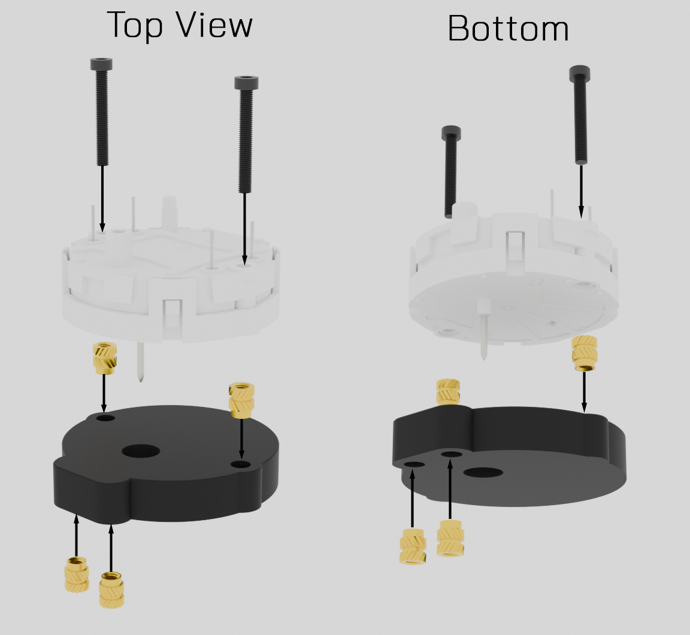
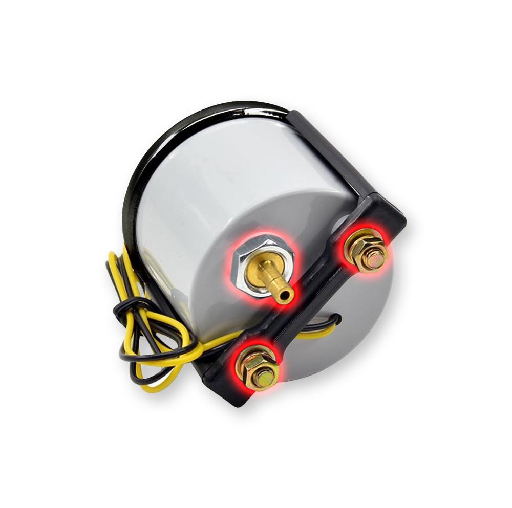
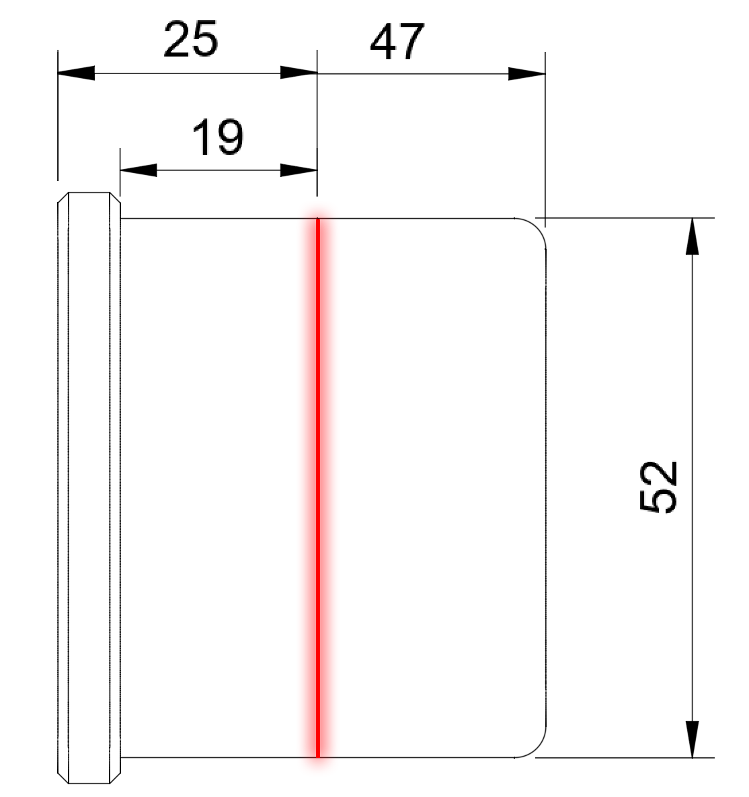
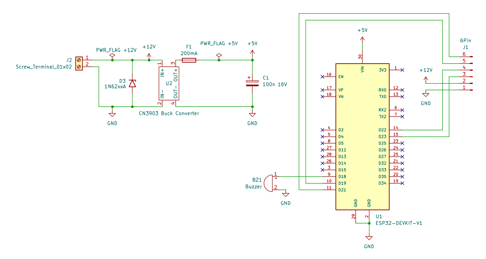
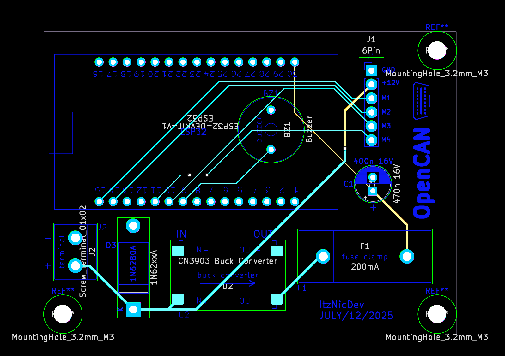
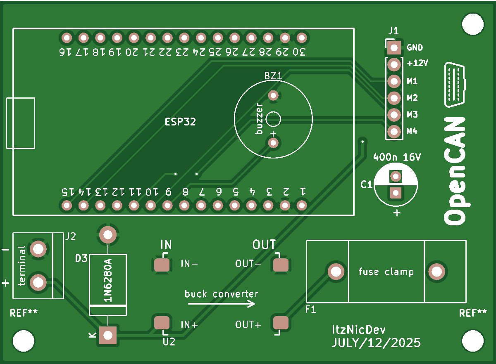

# OpenCAN

## 🔍 Project Overview

OpenCAN is a microcontroller-based project that reads live OBD-II data (e.g., turbo boost pressure or engine rpm) via Bluetooth and drives an analog pointer using a stepper motor. In a world where dashboards are becoming increasingly digital, OpenCAN revives the tactile, satisfying experience of real analog movement—because sometimes, a physical needle sweeping across a dial just feels more alive than pixels on a screen. The goal is to create smooth and responsive pointer movement despite delays in OBD-II data retrieval.

---

## 📑 Table of Contents
1. 🧰 Hardware Components
2. 🧊 Prepare 3D Printed Parts
3. 🏛️ Custom a-pillar trim
4. 🪚 Prepare Gauge Enclosure
5. ⚡️ Custom OpenCAN PCB
---

## 🧰 Hardware Components

### Core Modules

* 1x [ESP32-DEVKIT-V1](https://de.aliexpress.com/item/1005006128432036.html?spm=a2g0o.productlist.main.1.36c150d9Vynner&algo_pvid=f1c66e43-4416-4eb8-ad0a-b9c25d05ed2b&algo_exp_id=f1c66e43-4416-4eb8-ad0a-b9c25d05ed2b-0&pdp_ext_f=%7B%22order%22%3A%22461%22%2C%22eval%22%3A%221%22%7D&pdp_npi=4%40dis%21EUR%212.14%211.75%21%21%2117.55%2114.36%21%40210385bb17523962162358814e4418%2112000046958263336%21sea%21DE%216233624885%21X&curPageLogUid=PHptQbbetuGY&utparam-url=scene%3Asearch%7Cquery_from%3A) (30-Pin)
* 1x [X27168 Stepper Motor](https://de.aliexpress.com/item/1005001661473145.html?spm=a2g0o.productlist.main.1.5b1e7249E1hdXX&algo_pvid=ca190c73-cd1b-4d43-8954-def95e9eff1c&algo_exp_id=ca190c73-cd1b-4d43-8954-def95e9eff1c-0&pdp_ext_f=%7B%22order%22%3A%227%22%2C%22eval%22%3A%221%22%7D&pdp_npi=4%40dis%21EUR%212.32%211.49%21%21%212.65%211.70%21%402103849717523962718252836e21f9%2112000017032540183%21sea%21DE%216233624885%21X&curPageLogUid=fd8ccaZ4X9Gl&utparam-url=scene%3Asearch%7Cquery_from%3A)

### Power Supply
* 1x [2-Pin Screw Terminal](https://www.amazon.com/-/de/dp/B07QRHJ489?__mk_de_DE=%C3%85M%C3%85%C5%BD%C3%95%C3%91&dib=eyJ2IjoiMSJ9.uJUPY1QHu_fWzphlgpV5C9rjg_-6kPf9AhSlQLb9Lxgu2EzChWYjN7tAZ6Jf-WzKX6FF6YZppyRDppM2nW7oNz7bXXqc-LfImijAoRrFTN8MkNsacd6QBKhOIWn6UlQmwgnNxaHL3NZc-QQOLkMQ-nxxzz4H-Z1QKORLQTGsf65v5CTFbj2D6kPghJDnSBpAYk3Nm0HYQcfwZZjqPUVJ4k--A6OCZ4J9Wg6OBk0eQ10.crXagmvjyYh5XPkeH17DnOu5PxqpbA1QkpEDMX9H0zw&dib_tag=se&keywords=2-Pin%2BScrew%2BTerminal&qid=1752396909&sr=8-3&th=1)
* 1x [CN3903 Buck Converter](https://de.aliexpress.com/item/1005003239596512.html?spm=a2g0o.productlist.main.2.1176599feL7O6y&algo_pvid=c9ccdcb8-a0d6-4b6f-8f0f-f2d4d9f27fd4&algo_exp_id=c9ccdcb8-a0d6-4b6f-8f0f-f2d4d9f27fd4-1&pdp_ext_f=%7B%22order%22%3A%2239%22%2C%22eval%22%3A%221%22%7D&pdp_npi=4%40dis%21EUR%210.45%210.45%21%21%213.67%213.67%21%402103868817523963088208918ec918%2112000024801303076%21sea%21DE%216233624885%21X&curPageLogUid=ReUqz2F9l8rW&utparam-url=scene%3Asearch%7Cquery_from%3A) (12V to 5V)
* 1x [TVS Diode](https://www.amazon.com/dp/B079KHXZHK?psc=1&ref_=cm_sw_r_cp_ud_ct_7PG0FPYTPC88BNJHQAFG_1) (1N6280A)
* 1x [470nF 16V Capacitor](https://de.aliexpress.com/item/1005006075263546.html?spm=a2g0o.productlist.main.23.75b0c9c33Nwfwx&algo_pvid=88c34e0a-e5f4-4e8d-ad2e-4e08d97886e0&algo_exp_id=88c34e0a-e5f4-4e8d-ad2e-4e08d97886e0-20&pdp_ext_f=%7B%22order%22%3A%2214%22%2C%22eval%22%3A%221%22%7D&pdp_npi=4%40dis%21EUR%211.25%211.15%21%21%211.42%211.31%21%40211b6c1917523964976586004e47b6%2112000035613539186%21sea%21DE%216233624885%21X&curPageLogUid=O8hK2Kwejpsj&utparam-url=scene%3Asearch%7Cquery_from%3A)
* 1x [Fuse Holder](https://www.amazon.com/-/de/dp/B074N1NMMX?__mk_de_DE=%C3%85M%C3%85%C5%BD%C3%95%C3%91&crid=2SBTZKT3UCUQ&dib=eyJ2IjoiMSJ9.nHToP20kJLmZshZ_M0ktCMHD9RnAVLlrLyILkyOg4lknW3CdUnjPFvPezVrIsojj-x5a5LbH_jVb_DVyeVXdUkSCjx9jykRxEJOJs6KnH9VgOINRdQscJS-2rSCpN-LD_lS8hbSwVszTsF0Q66Tp0WjJC0yIHGaB9o4uE6svlwgQr0cxuMLgJ_0RaKG_0Viw.0sutghmPgI0P8xBa6hq1SZ7FRD4MUOUzfyrJNIjGa4g&dib_tag=se&keywords=sicherungshalter+pcb&qid=1752396826&sprefix=sicherungshalter+pc%2Caps%2C221&sr=8-30&xpid=1sYgBZV_GLwhn) with [200mA Glass Fuse](https://www.amazon.com/-/de/dp/B074L7Z342?__mk_de_DE=%C3%85M%C3%85%C5%BD%C3%95%C3%91&crid=13Z6DV9I4ZBOU&dib=eyJ2IjoiMSJ9.LIM3b-PhLp5Zu3U4-TNOuEpsv8Xwz1ZNONAtzY1JwJ57WUKEqeybomcOKXZifb_w91XlQu3fEkOsbyxH2hhwrGBx3Tjdw4O55JKQHAp-My_aW8m_vvN66nC-p8kEwng9VIYlZ-A5hHB-413iY5QFCsBTvZoy2Px10v3INejbJEgXiGtwYZWc_V79y10wjGft_u7EylvF7QK2PQ6ovFoYmjSz5XYwrjMQoylsFJFRfkK3eteB7VwcgbsNa3oiJXc_iVU15HVRm8ROSzFozChDlb8WGJkCRdJcjQ-zGeCRoqM.VSXbczhZPxHbQfqDxj-wtgajRLVUzfQy67ioxIvlZ60&dib_tag=se&keywords=glass+fuse+200ma&qid=1752396753&sprefix=glass+fuse+200m%2Caps%2C245&sr=8-5)

### Additional Components

* 2x [15-Pin Header Socket](https://www.amazon.com/-/de/dp/B08DVGCTKT?__mk_de_DE=%C3%85M%C3%85%C5%BD%C3%95%C3%91&crid=GXC2RSEQUWJJ&dib=eyJ2IjoiMSJ9.F6JUkZTU-stCHqmq-iAIuMEe415-CNFjACNxmpJpwnnrd2NBhMQtE_Y7NULHezwmB6dUmVihC-APueO34gEUiBNyaJpRZ15_bW7hyfXwGCfdxfdZ9eg9GHqSc0hVUuWBBmPzoyE5DJ0V1HI3yE12K4terh7mSPem8wkGEgW4XKGmdQmycc5AUeHSOS2spECj4DL_K3xhjk8wHer8fFmYJRZf6kflPKP6-pJJSFBI0iQ.WnPQ1nI-MXgR_V82nt2K_3ra2xhozqH3QIGRJM6YfT8&dib_tag=se&keywords=pin+header&qid=1752396878&sprefix=pin+header%2Caps%2C221&sr=8-11)
* 3x [M3 Screws](https://de.aliexpress.com/item/1005004527586307.html?spm=a2g0o.productlist.main.7.1c0e83pH83pHDK&algo_pvid=ee12877b-5e38-4728-beaa-28559f366fc3&algo_exp_id=ee12877b-5e38-4728-beaa-28559f366fc3-6&pdp_ext_f=%7B%22order%22%3A%226115%22%2C%22eval%22%3A%221%22%7D&pdp_npi=4%40dis%21EUR%210.96%210.96%21%21%211.09%211.09%21%40210385bb17523969573361899e441d%2112000029486656871%21sea%21DE%216233624885%21X&curPageLogUid=n5f3XXGpyUBB&utparam-url=scene%3Asearch%7Cquery_from%3A)
* 3x [M3 Threaded heat-set inserts](https://de.aliexpress.com/item/1005006472962973.html?spm=a2g0o.productlist.main.1.687c5125OYvhMS&algo_pvid=aa5009d6-1880-4990-88e9-70ea73f17982&algo_exp_id=aa5009d6-1880-4990-88e9-70ea73f17982-0&pdp_ext_f=%7B%22order%22%3A%226242%22%2C%22eval%22%3A%221%22%7D&pdp_npi=4%40dis%21EUR%214.78%211.75%21%21%215.45%211.99%21%40210391a017523970797643092e154c%2112000037324316041%21sea%21DE%216233624885%21X&curPageLogUid=hB6lhYICHs4k&utparam-url=scene%3Asearch%7Cquery_from%3A)
* 1x [Custom OpenCAN PCB](#-pcb-layout) (See [Gerber Files](gerber_files) for further information)
* 1x [Guage Enclosure](https://de.aliexpress.com/item/1005007197636240.html?src=google&pdp_npi=4%40dis!EUR!21.24!10.69!!!!!%40!12000039773227749!ppc!!!&snpsid=1&snps=y&albch=shopping&acnt=272-267-0231&isdl=y&slnk=&plac=&mtctp=&albbt=Google_7_shopping&aff_platform=google&aff_short_key=UneMJZVf&=&albagn=888888&ds_e_adid=&ds_e_matchtype=&ds_e_device=c&ds_e_network=x&ds_e_product_group_id=&ds_e_product_id=de1005007197636240&ds_e_product_merchant_id=5551326180&ds_e_product_country=DE&ds_e_product_language=de&ds_e_product_channel=online&ds_e_product_store_id=&ds_url_v=2&albcp=20536662168&albag=&isSmbAutoCall=false&needSmbHouyi=false&gad_campaignid=19235627944)

### 🧊3D Printed Parts
* 1x [Gauge Cup](3D_models/Suzuki_Swift_Sport/Gauge_Cup.3mf)
* 1x [Gauge Adapter Ring](3D_models/gauge_adapter_ring.3mf)
* 1x [X27168 Adapter Plate](3D_models/x27168_adapter_plate.3mf)

Don’t have a 3D printer? No problem! Services like [JLCPCB](https://jlc3dp.com/3d-printing-quote) now offer 3D printing too – you can upload the models directly and have them printed and shipped to you. Just make sure to choose a heat-resistant material since temperatures inside a car can get pretty high, especially in summer.

---

## 🧊 Prepare 3D Printed Adapter Plate
This part consists of melting the **threaded heat-set inserts** (M2) into the [X27168 adapter plate](3D_models/x27168_adapter_plate.3mf) both top and bottom and mounting the **X27168** step motor with the **M2 screws**.



---
## 🏛️ Custom a-pillar trim
You may have noticed that the Gauge Cup is only available for the [Suzuki Swift Sport](3D_models/Suzuki_Swift_Sport/Gauge_Cup.3mf). This is because it would be impossible for me as a single person to cover a wide range of vehicles. That's why I only decided to draw such a gauge cup for my car. But in the following I will explain how to make your own gauge cup with simple household tools.

Of course, there are several ways to make a cover for the A-pillar. In the following, however, I will limit myself to the following:

### Molding via wire
Grab a wire that is easy to bend (copper, aluminum) and bend it around the A-pillar at fixed intervals. Stick the pieces of wire onto a sheet of paper with adhesive tape and scan it with a scanner. In the CAD program of your choice, you can arrange and draw the sides scanned by the scanner at the previously fixed distances.

---

## 🪚 Prepare Gauge Enclosure
Remove the nuts marked in the picture



---
Cut along the marked line with a dremel to separate the glass part from the rest. Carefully remove the unit from the cut-open enclosure and put it away in the meantime and sand the rough edges of the enclosure. Be careful not to scratch the front of the glass while cutting and sanding. It helps to cover it with masking tape.



---

Take your unit from before and carefully lift the plastic sheet scale at one of the red marked tabs to remove it from the plastic cage completely.


---

Now that the plastic sheet scale has been removed, 2 screws will appear. Unscrew these and you will notice that the circuit board (white), the plastic cage (black plastic with conical top in the middle) and the rear brass part are now separated from each other. The brass part is no longer important for us and has no further use.


---

Now the plastic sheet scale, the plastic cage (black plastic with conical top in the middle) and the pcb (background lighting) can be combined with the previously assembled adapter plate.


---


## ⚡️ Custom OpenCAN PCB
### Schematic



---

### PCB-Layout


---

### Ordering
The custom pcb can be ordered from manufacturers such as [JLCPCB](https://cart.jlcpcb.com/quote?spm=Jlcpcb.Homepage.1006). In the case of [JLCPCB](https://cart.jlcpcb.com/quote?spm=Jlcpcb.Homepage.1006), it is recommended to choose the lead-free HASL for the surface finish for health reasons. The PCB color can also be selected, but this may incur additional costs. Also make sure that a PCB thickness of 1.6 mm is selected

---

### Printed PCB



---

### ⚡ Electrical Flow Diagram

```text
12V (Car Battery)
├── TVS Diode
├── LED (optional)
├── Buck Converter (12V → 5V)
│   ├── Fuse (200mA)
│   ├── Capacitor (470nF)
│   └── ESP32
│       ├── Buzzer
│       └── Stepper Motor (X27168)
```

---

## 🔁 Pointer Movement Logic (Interpolation Algorithm)

### ⚠️ The Problem

OBD-II data via Bluetooth (e.g., ELM327) introduces blocking delays (typically 80–150 ms). During this blocking time, the microcontroller can't update the motor, resulting in jerky and unresponsive pointer behavior.

### 💡 The Solution: Linear Interpolation

To solve this, OpenCAN simulates smooth transitions between OBD data points using linear interpolation:

#### 1. Periodic, Blocking Data Fetch

* A new target value is fetched every `obdRequestInterval` (e.g., 150ms)
* When new data arrives:

  * Start point (`V0`) is set to the previous target value
  * End point (`V1`) is the newly received value
  * Start time (`t0`) is recorded

#### 2. Continuous Interpolation in Loop

* On every iteration of the `loop()`, if not blocked by data fetch:

  * Calculate progress:

    ```
    progress = (currentTime - t0) / obdRequestInterval
    ```
  * Calculate interpolated target:

    ```
    V_interpolated = V0 + (V1 - V0) * progress
    ```
  * Send `V_interpolated` to `motor.setTargetAngle()`
  * `motor.update()` ensures the motor continuously moves towards this value

### ✅ Result

* The pointer moves smoothly between data points
* Movement appears fluid and responsive, independent of the actual data delay

---

## 🏃 Code-Flow-Diagram

